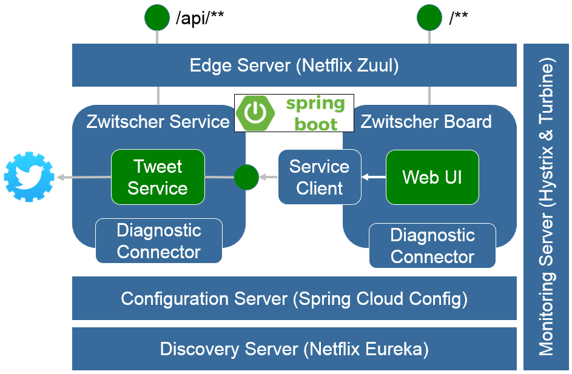

[](https://travis-ci.org/qaware/cloud-native-zwitscher)
[](https://waffle.io/qaware/cloud-native-zwitscher)
[](https://waffle.io/qaware/cloud-native-zwitscher)
[](https://github.com/qaware/cloud-native-zwitscher/blob/master/LICENSE)

# Cloud Native Zwitscher Showcase

This showcase demonstrates how to build a cloud native application using
Spring Boot, Spring Cloud and Netflix OSS components. The individual parts
will later be deployed and run on Mesos with Kubernetes.



## Build instructions

In order to compile and run the examples you do not need much. A recent JDK8 needs to
be available in your SEU.
```shell
$ ./gradlew clean build
```

## Usage instructions

For the showcase to be fully operational you need to configure your own Twitter API key and secret. First, follow
the instructions on https://spring.io/guides/gs/register-twitter-app/. Once you have a API key and secret, insert
these into the configuration `zwitscher-config/src/main/resources/config/zwitscher-service.yml`

```yml
spring:
  social:
    twitter:
      appId: <<Insert Twitter API key here>>
      appSecret: <<Insert Twitter API key secret here>>
```

## Running the Cloud Native Zwitscher showcase

The showcase can be run on your local machine as well as on Mesos with Kubernetes.

### Local maschine

To run the showcase locally build the showcase and run the individual parts in a
separate console window.

Start the Zwitscher Eureka server
```shell
$ cd cloud-native-zwitscher
$ ./gradlew :zwitscher-eureka:bootRun
```

Start the Zwitscher config server
```shell
$ cd cloud-native-zwitscher
$ ./gradlew :zwitscher-config:bootRun
```

Start the Zwitscher service server
```shell
$ cd cloud-native-zwitscher
$ ./gradlew :zwitscher-service:bootRun
```

Start the Zwitscher board UI server
```shell
$ cd cloud-native-zwitscher
$ ./gradlew :zwitscher-board:bootRun
```

Start the Zwitscher edge server
```shell
$ cd cloud-native-zwitscher
$ ./gradlew :zwitscher-edge:bootRun
```

Start the Zwitscher monitoring server
```shell
$ cd cloud-native-zwitscher
$ ./gradlew :zwitscher-monitor:bootRun
```

If everything has started OK, you can access the the services under the following URLs:

* **Eureka server**: http://localhost:8761
* **Config server**: http://localhost:8888
* **Service server**: http://localhost:8080
* **Board server**: http://localhost:8081
* **Edge server**: http://localhost:8765
* **Monitoring server**: http://localhost:8989


### Docker Compose

To run the complete showcase using docker locally, please ensure that Docker is running and can be accessed
by Gradle correctly:
```shell
$ cd cloud-native-zwitscher
$ ./gradlew dockerVersion dockerInfo
```

If the connection to the Docker daemon can be established, you will see some version and detail information printed
in the console. Assuming you have already build the project, you need to build the Docker images:
In order to compile and run the examples you do not need much. A recent JDK8 needs to
be available in your SEU.
```shell
$ ./gradlew buildDockerImage
```

Once this is done, open a Docker terminal and issue the following command in the project directory:

```shell
$ cd cloud-native-zwitscher
$ docker-compose up -d
$ docker-compose logs
```

This will start all the Docker images in the correct order. The instances can then be accessed via their known ports
and the IP address of your Docker installation, usually something like `192.168.99.100`.

To shutdown and remove everything again, kill and remove the Docker containers first, and finally you can remove the
Docker images again if you wish.

```shell
$ docker-compose kill
$ docker-compose rm
$ ./gradlew removeDockerImage
```

### Kubernetes

#### Installation

Before you can run anything, you need to setup the actual Kubernetes installation you want
to deploy the showcase to. For local development use Vagrant, otherwise choose a cloud provider such as AWS or GCE. There are 3 shell scripts provided (`k8s-setup-vagrant.sh`, `k8s-setup-aws.sh`, `k8s-setup-gce.sh`). For AWS and GCE you need to configure your environment
properly and you need to have a paid account. For more details on the prerequisites read
the official [Getting Started Guides](http://kubernetes.io/docs/getting-started-guides/).

To verify that your Kubernetes cluster is alive and healthy, issue the following command:
```shell
kubectl.sh cluster-info
```

#### Preparation

In order to run the showcase using Kubernetes on either AWS, GCE or Vagrant you
need to Dockerize the showcase. If you plan to use AWS or GCE, stop reading here:
the images are already available at the QAware OSS Bintray Docker registry.

If you plan to deploy and run the showcase locally or you want to use your own
Docker registry then continue. Basically, following the instructions above on how
to build the Docker images using Gradle.

Then tag the latest images by running the following command. You will have to substitute
the `qaware-oss-docker-registry.bintray.io` registry URL with your custom URL.
```shell
docker tag <IMAGE_ID> qaware-oss-docker-registry.bintray.io/zwitscher/zwitscher-eureka:<VERSION>
docker tag <IMAGE_ID> qaware-oss-docker-registry.bintray.io/zwitscher/zwitscher-config:<VERSION>
docker tag <IMAGE_ID> qaware-oss-docker-registry.bintray.io/zwitscher/zwitscher-service:<VERSION>
docker tag <IMAGE_ID> qaware-oss-docker-registry.bintray.io/zwitscher/zwitscher-board:<VERSION>
docker tag <IMAGE_ID> qaware-oss-docker-registry.bintray.io/zwitscher/zwitscher-edge:<VERSION>
docker tag <IMAGE_ID> qaware-oss-docker-registry.bintray.io/zwitscher/zwitscher-monitor:<VERSION>
```
`<IMAGE_ID>` - The image ID from the latest versioned image previously created.
`<VERSION>` - Should be the actual Zwitscher showcase version, like 1.0.1. When not specified
"latest" will be used as the Bintray version name.

Use the Docker client push command to upload and publish your images (please use
Docker v1.6 and above):
```shell
docker push qaware-oss-docker-registry.bintray.io/zwitscher/zwitscher-eureka
docker push qaware-oss-docker-registry.bintray.io/zwitscher/zwitscher-config
docker push qaware-oss-docker-registry.bintray.io/zwitscher/zwitscher-service
docker push qaware-oss-docker-registry.bintray.io/zwitscher/zwitscher-board
docker push qaware-oss-docker-registry.bintray.io/zwitscher/zwitscher-edge
docker push qaware-oss-docker-registry.bintray.io/zwitscher/zwitscher-monitor
```

Alternatively you can also use Gradle to upload the Docker images to your Bintray
Docker registry.
```shell
$ ./gradlew pushDockerImage -PbintrayUsername=<<INSERT USERNAME>> -PbintrayApiKey=<<INSERT API KEY>>
```

#### Deployments

Now you can create the Kubernetes deployments one by one and see how the Zwitscher
showcase becomes alive. In the project root directory issue the following commands:
```shell
kubectl.sh create -f zwitscher-eureka/k8s-zwitscher-eureka.yml
kubectl.sh create -f zwitscher-config/k8s-zwitscher-config.yml
kubectl.sh create -f zwitscher-service/k8s-zwitscher-service.yml
kubectl.sh create -f zwitscher-board/k8s-zwitscher-board.yml
kubectl.sh create -f zwitscher-edge/k8s-zwitscher-edge.yml
kubectl.sh create -f zwitscher-monitor/k8s-zwitscher-monitor.yml
kubectl.sh get pods,deployments,services
kubectl.sh scale deployment zwitscher-service --replicas=2
kubectl.sh get pods,deployments
```

To setup or tear down the whole Zwitscher Showcase at once you can also use the provided
full Kubernetes deployment descriptor:
```shell
kubectl.sh create -f k8s-zwitscher.yml
kubectl.sh get pods,deployments,services
kubectl.sh delete -f k8s-zwitscher.yml
```

### DC/OS

You need a DC/OS cluster with at least 3GB free RAM.
That amounts to one instance of each service.
You can use the DC/OS Vagrant to run a DC/OS cluster on your local machine,
provided your computer has at least 16GB of RAM
(https://github.com/dcos/dcos-vagrant).

With DC/OS Vagrant installed, use the following command to spin up a properly
sized cluster.
```shell
vagrant up m1 a1 a2 a3 boot
```

Each service comes with it's own Marathon config file. You can deploy the
services one at a time or all at once.

Example deployment of the config service:
```shell
curl -X POST http://m1.dcos:8080/v2/apps -H "Content-type: application/json" -d @zwitscher-config/marathon-zwitscher-config.json
```

Deploying all services at once:
```shell
./marathon-deploy-all.sh
```

#### Troubleshooting

* Download dauert zu lange
* Zu wenig resourcen für VBox
* 

## References

* [Spring Initializr](https://start.spring.io)
* [Spring Cloud](http://projects.spring.io/spring-cloud/)

## License

This software is provided under the MIT open source license, read the `LICENSE.txt` file for details.
